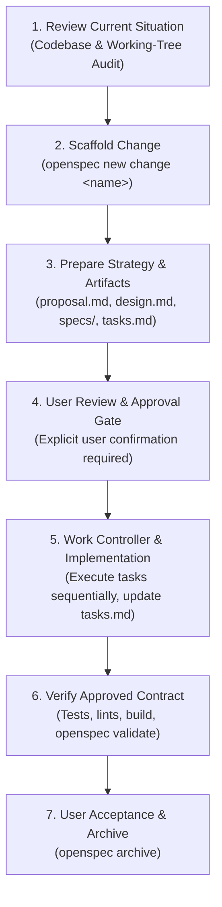

# Cash Flow Tracker — Agent Instructions & Workflow Baseline

This document records approved project standards, architecture decisions, and the mandatory execution workflow for **Cash Flow Tracker**. Future agents and pair-programming sessions MUST read `/Users/enrico/project/AGENTS.md`, `/Users/enrico/project/AI_PROJECT_DELIVERY_STANDARD.md`, and this file before performing meaningful work.

---

## 1. Purpose and Core Mission

**Cash Flow Tracker** is a self-hosted personal finance companion designed for **daily mindfulness and friction-free money tracking**.
- **Primary Goal:** Make it effortless to record daily cash in/out, monitor accounts, track payday cycles, and know how much is safe to spend today without boredom or forgetfulness.
- **Non-Goals:** It is NOT an enterprise resource planning (ERP) system, a complex multi-state budgeting machine, an investment portfolio manager, or a debt-collection tracking engine.

---

## 2. Mandatory Spec-Driven Workflow (OpenSpec Standard)

No non-trivial implementation shall occur without an approved OpenSpec change. All work follows the 7-stage OpenSpec Core lifecycle:



### Stage 1: Review Current Codebase Situation
- Audit active files, migrations, models, endpoints, and working-tree status before planning.
- Identify technical debt, redundant abstractions, and constraints.
- Document facts and authoritative requirements; never guess user intent.

### Stage 2: Scaffold OpenSpec Change
- Initialize/maintain change under `openspec/changes/<change-name>/`.
- Use schema `spec-driven` with `.openspec.yaml`.

### Stage 3: Prepare Strategy, Specs, and Implementation Plan
Every change requires 4 foundational artifacts:
1. **`proposal.md`**:
   - `## Why`: Clear problem statement and motivation.
   - `## What Changes`: Concrete scope of functional and technical modifications.
   - `## Capabilities`: New or modified capabilities (`<capability-name>`).
   - `## Impact`: Affected files, database impact, API changes, dependencies.
   - `## Expected Outcome`: User-visible and system-visible end state in plain language.
2. **`specs/<capability>/spec.md`**:
   - Formal, testable requirements using `SHALL` language.
   - Concrete Gherkin scenarios: `#### Scenario: ...`, `- **WHEN** ...`, `- **THEN** ...`.
3. **`design.md`**:
   - Technical strategy, data structures, endpoint contracts, error handling, and trade-offs.
   - Guardrails against over-engineering and scope creep.
4. **`tasks.md`**:
   - Phased, numbered, checkable tasks (`- [ ] 1.1 ...`, `- [ ] 2.1 ...`).
   - Each phase states its **Expected Result** and verification evidence.
   - Tasks describe concrete deliverables, not open-ended activities.

### Stage 4: User Review & Approval Gate
- Present artifacts to the user for explicit review and feedback.
- **STOP and wait for user approval** before writing implementation code. Do not proceed until approved.

### Stage 5: Work Controller & Execution
- Implement sequentially from `tasks.md`.
- Mark completed tasks immediately: `- [ ]` $\rightarrow$ `- [x]`.
- Keep code changes minimal, focused, and scoped strictly to the active task.
- **Pause rule:** If ambiguity, an unforeseen blocker, or a design flaw is uncovered, pause immediately, report to the user, and suggest artifact adjustments before continuing.

### Stage 6: Verification & Contract Validation
- Run targeted automated tests, linters, type checks, build commands, and `git diff --check`.
- Execute `openspec validate <change-name>` to verify specification integrity.
- Perform end-to-end smoke testing for all newly introduced/modified behavior.

### Stage 7: Acceptance & Archive
- Present verification proof to the user for final acceptance.
- On user approval, archive the change with `openspec archive <change-name>`.

---

## 3. Current State & Codebase Situation

- **Legacy Bloat (Phases 2–5):** The legacy codebase accumulated 34 database migrations, 13 frontend pages, duplicate routers (`routers/web.py` 2.2k lines and `routers/public.py` 1.8k lines), and 5 overlapping abstraction layers (Buckets, Allocation Plans, Strategy Rules, Financial Goals, Obligations, Assets, Net Worth).
- **Approved Decision:** Clean-slate refactor approved by project owner. We do **NOT** need to write backward-compatibility data migrations or retain legacy migration tables.
- **Target Source Layout:** Consolidate into a clean, role-based structure following `/Users/enrico/project/AI_PROJECT_DELIVERY_STANDARD.md`.

---

## 4. Architecture Guardrails & Decisions

### 1. Minimal 5-Table Data Model
Only 5 core persistence entities are permitted:
1. `users`: Authentication, session secret, invite code, payday cycle day, currency.
2. `accounts`: Liquid cash holders (Cash, Bank, E-wallet), current balance, archived status.
3. `categories`: Spending/income labels, icon, color, optional monthly budget ceiling.
4. `transactions`: Daily cash movements (Expense, Income, Internal Transfer), timestamp, notes, receipt.
5. `api_keys`: Hashed Bearer tokens for external automation (Telegram bot).

*Strictly Prohibited:* Do not reintroduce buckets, allocation state machines, strategy rules, goal projections, debt/loan obligations, investment assets, or background auto-funding schedulers.

### 2. Unified Backend (FastAPI)
- Single auth dependency resolving either session cookies (browser) or Bearer API keys (Telegram bot).
- No duplicate endpoint trees.
- Direct, high-performance endpoints:
  - `GET /api/pulse`: Today's spending, remaining daily allowance, monthly pace, recent feed.
  - `POST /api/transactions`: 1-call expense/income/transfer entry.
  - `GET /api/insights`: Visual category breakdown and cycle spending histogram.
  - `GET/POST /api/accounts`: Balances and quick movement.

### 3. Anti-AI-Slop Visual & Interaction Standard (Scandinavian Tactile Minimalist)
- **Authoritative Standard:** All frontend implementations MUST strictly comply with [`/Users/enrico/project/UI_UX_DESIGN_STANDARD.md`](file:///Users/enrico/project/UI_UX_DESIGN_STANDARD.md).
- **No AI-Slop:** No rainbow gradients, no blurry purple glow dropshadows, no meaningless 0–100 pseudo health meters, no 24px-padded empty bubbly cards, and no slow bouncy animations.
- **Craft & Density (Linear / Scandinavian / Apple Card aesthetic):**
  - Desktop floating container architecture (`rounded-[28px]`, `#F8F8F6` window, `#ECECE8` desktop canvas).
  - Crisp typography (`tabular-nums` for all currency, percentages, counts, and dates).
  - High-contrast neutral palette, subtle 1px structural borders (`#E5E5DF`).
  - **Signature Spring Lime (`#66CC55`)** for active navigation pills, peak chart highlights, and primary positive actions.
  - **Matte Charcoal (`#1E201E`)** for structural action buttons (`+ Catat Transaksi`, `+ Tambah Rekening`).
  - **Pastel Status Badges:** Mint (Success/Income), Amber (Warning/Approaching Limit), Coral (Danger/Expense), Sky Blue (Transfer), Lavender (Investment).
  - **Right Slide-Out Context Drawer (Sheet):** High-density inspection/editing drawer (Ref 6) replacing modal dialogs for row details.
- **Core Screen Workbenches:**
  1. **Pulse / Beranda (`/`):** 4-card top KPI strip, analytical takeaway banner, 2-column split (Activity table + Right Action Rail with "Lakukan Segera" queue and mini liquid vault).
  2. **Ledger / Transaksi (`/ledger`):** Filter chip bar, dense data table with status pills, slide-out detail sheet, non-polluted cash flow totals.
  3. **Insights / Analisis (`/insights`):** Daily cadence bar chart with Lime peak highlight, bullet benchmark category cards, Kakeibo 50/30/20 comparison.
  4. **Accounts / Vault (`/accounts`):** Net worth & runway header, physical card style accounts, investment portfolio vault.

---

## 5. Local Commands

```bash
# OpenSpec
openspec status
openspec status --change <change-name>
openspec validate <change-name>
openspec archive <change-name>

# Backend
cd backend
source .venv/bin/activate
uvicorn app.main:app --reload --port 8000
python -m pytest tests/

# Frontend
cd frontend
npm run dev
npm run type-check
npm run lint
npm run build

# Docker
docker compose up -d
docker compose down
```

---

## 6. Security & Secrets Sanitization Guardrail (MANDATORY)

- **NEVER print, cat, read, or output sensitive credentials, secret values, tokens, API keys, private keys, or passwords in tool outputs or terminal commands.**
- **Inspecting Environment Files:** When inspecting `.env`, `runtime.env`, secrets files, or configuration files, agents **MUST extract ONLY variable names/keys** (e.g. `cut -d= -f1`, `awk -F= '{print $1}'`), NEVER the values.
- **Handling Secrets:** If a secret is required in a configuration, CI/CD secret, or script, provide the variable name and instructions for the user to populate or set it, or use placeholders. Never dump plaintext secrets to the console, logs, or chat transcripts.

---

## 7. Production Isolation Guardrail (MANDATORY)

- **Strict Production Protection:** Agents SHALL NOT directly connect to, SSH into, run commands on, or perform any actions against the production server UNLESS the user explicitly provides a direct request that explicitly says to connect to the production server.
- **Local Development Exclusivity:** All problems, issues, and bugs reported by the user MUST be diagnosed, reproduced, tested, and resolved strictly within the local development environment.
- **Pipeline-Driven Deployment Only:** Fixes MUST be deployed to the production server strictly through designated automated deployment pipelines or approved release scripts (`deploy_remote_release.sh`). Production issues must be resolved either through deployed code fixes or user interaction matching the latest implementation updates.
- **No Manual Production Tampering:** NEVER manually edit code, alter environment files, or execute ad-hoc database modifications directly on the production host.
- **Schema Migrations Mandatory:** Any database schema adjustments MUST be implemented via versioned schema migration scripts executed through the deployment workflow, never via manual or direct DDL execution on production databases.

---

## 8. Skill Usage Baseline Standard (Ponytail & Caveman)

This project strictly adheres to the global Skill Usage Baseline Standard defined in `/Users/enrico/project/AGENTS.md`:

1. **Ponytail (Anti-Bloat & Radical Simplicity):**
   - **Default:** Always active (`full`) on all code generation, refactoring, and bug fixes.
   - **Enforce the 7-Rung Ladder:** YAGNI $\rightarrow$ Project Reuse $\rightarrow$ Stdlib $\rightarrow$ Platform Native $\rightarrow$ Installed Deps $\rightarrow$ One-liner $\rightarrow$ Minimum code.
   - **No Bloat:** In this project, keep the 5-table data model pristine. Reject any reintroduction of legacy abstractions (buckets, allocation engines, goal simulators).
   - **Root-Cause Bug Fixing:** Grep all callers before touching shared functions; fix once at the source.
   - **Diff Auditing:** Run `ponytail-review` on git diffs before concluding implementation tasks.

2. **Caveman (Zero-Fluff High-Density Communication):**
   - **Default:** Active during fast debugging and task execution loops.
   - **Pattern:** `[target] [action] [root cause]. [next step].`
   - **Exceptions:** Always revert to clear, complete prose for destructive database commands, security warnings, or OpenSpec strategy deliverables.
