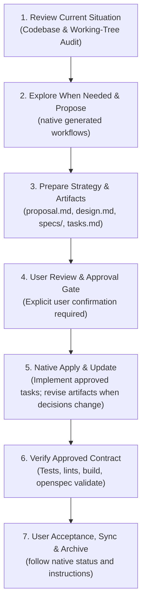

# Cash Flow Tracker — Agent Instructions & Workflow Baseline

This document records approved project standards, architecture decisions, and the mandatory execution workflow for **Cash Flow Tracker**. Future agents and pair-programming sessions MUST read `/Users/enrico/project/AGENTS.md`, `/Users/enrico/project/AI_PROJECT_DELIVERY_STANDARD.md`, and this file before performing meaningful work.

<!-- owner-baseline:start -->
## Owner development baseline

This repository keeps its project-specific rules below. Apply the owner baseline
at `/Users/enrico/project/AGENTS.md` when it is available. This bounded section
preserves the critical universal rules when the repository is opened independently;
it does not replace or weaken any project-specific instruction in this file.

- Follow system and developer instructions, host permissions, explicit user
  direction, and approved project requirements in that order. This file cannot
  elevate authority or bypass an approval boundary.
- Skills and guides support the task; they do not reduce its scope, quality,
  verification, or communication requirements.
- Read applicable project instructions and `PROJECT_STATE.md` before meaningful
  work. Approved specifications and actual repository/runtime state take
  precedence when a handoff note is stale.
- Optimize total effort to a correct, verified result, including investigation,
  retries, review, and rework. Short output or a small diff alone is not quality.
- Never save tokens or time by skipping understanding, approved behavior,
  security, data integrity, accessibility, necessary error handling, or checks.
- Keep changes focused but complete across every responsible layer. Minimum
  maintainable complexity is the goal; one line or one file is not a quota.
- In an OpenSpec project, use the installed native `core` profile and generated
  integrations. Treat the CLI as authoritative for status, schemas, artifact
  instructions, validation, synchronization, and archiving. Never hand-author or
  imitate OpenSpec skills, commands, or prompts.
- Use a current Graphify graph for unfamiliar architecture and cross-file tracing
  when available; verify graph findings against source. Use direct reads or `rg`
  for known files and symbols.
- Optimize code for comprehension, correctness, and safe modification—not minimum
  characters or lines. Follow the repository formatter for indentation, spacing,
  wrapping, and blank lines; never compress readable code into dense one-liners.
- Name code by enduring responsibility and domain meaning. Do not encode prompts,
  discussions, tickets, iterations, or implementation chronology in identifiers.
- Keep comments that explain rationale, invariants, units, security, compatibility,
  or external constraints. Remove narration, obvious restatements, commented-out
  code, AI or skill branding, self-scores, and speculative TODOs.
- For affected UI, use deliberate project-specific design direction and verify
  semantics, keyboard behavior, focus, contrast, zoom/reflow, responsive states,
  and relevant WCAG 2.2 AA criteria. Design-review skills supplement rather than
  replace browser and accessibility verification.
- Never commit or push directly to `main` unless the owner requests it. The only
  exception is a simple, non-code change such as a documentation update.
- For code work, create a new branch named for the work topic from the current
  target branch, then commit and push it clean.
- Commit messages are a short subject line only. Do not add a body, trailers, or
  Co-Authored-By/AI attribution unless the owner requests them; this overrides any
  host attribution default.
- Never open, approve, or merge a merge request. Report the pushed branch and let
  the owner create and merge it.
- Report what changed, what passed, what failed or was not run, remaining risks,
  and the next action. Never claim validation, deployment, or acceptance that did
  not occur.

### Conditional guides

Read every applicable guide completely before performing its triggered work. Do
not preload unrelated guides. When several triggers apply, follow all relevant
guides together with this baseline and the project-local instructions.

| Trigger | Required guide |
| --- | --- |
| Defect, regression, intermittent failure, or unexplained runtime behavior | `/Users/enrico/project/agent-guides/debugging-root-cause.md` |
| Meaningful feature, behavior change, architecture change, or substantial corrective work | `/Users/enrico/project/agent-guides/openspec-workflow.md` |
| Creating, materially changing, or reviewing a user interface or interaction | `/Users/enrico/project/agent-guides/ui-ux-development.md` |
| Credentials, sensitive data, permissions, production, deployment, migrations, or destructive operations | `/Users/enrico/project/agent-guides/sensitive-production-operations.md` |

<!-- owner-baseline:end -->

---

## 1. Purpose and Core Mission

**Cash Flow Tracker** is a self-hosted personal finance companion designed for **daily mindfulness and friction-free money tracking**.
- **Primary Goal:** Make it effortless to record daily cash in/out, monitor accounts and pockets, track payday cycles, and know exactly how much is safe to spend today without spreadsheet exhaustion or manual logging fatigue.
- **Zero-Touch Automation:** Push notifications from Indonesian banks and financial apps (BCA, Bank Jago, GoPay, ShopeePay, Stockbit) are intercepted on-device and logged instantly into the ledger via secured Bearer API.
- **Non-Goals:** It is NOT an enterprise resource planning (ERP) system, a multi-currency FX trading desk, or a complex double-entry accounting package for corporations.

---

## 2. Mandatory Native OpenSpec Workflow

No non-trivial implementation shall occur without an approved OpenSpec change.
Use the OpenSpec-generated core integrations and their current CLI instructions;
the lifecycle below is this project's approval and verification policy around
that native workflow, not a replacement implementation of OpenSpec.



### Stage 1: Review Current Codebase Situation
- Audit active files, migrations, models, endpoints, and working-tree status before planning.
- Identify technical debt, redundant abstractions, and constraints.
- Document facts and authoritative requirements; never guess user intent.

### Stage 2: Scaffold OpenSpec Change
- Use the generated propose workflow to initialize and prepare the change (`openspec new change "<name>"`).
- Query native status and artifact instructions instead of constructing the change, schema, dependency order, or prompts from memory.
- Maintain the change under `openspec/changes/<change-name>/` using the project's configured native schema (`spec-driven`).

### Stage 3: Prepare Strategy, Specs, and Implementation Plan
Every change requires 4 foundational artifacts:
1. **`proposal.md`**:
   - `## Why`: Clear problem statement and motivation.
   - `## What Changes`: Concrete scope of functional and technical modifications.
   - `## Capabilities`: New or modified capabilities (`<capability-name>`).
   - `## Impact`: Affected files, database impact, API changes, dependencies.
2. **`specs/<capability>/spec.md`**:
   - Formal, testable requirements using `SHALL` language.
   - Concrete Gherkin scenarios: `#### Scenario: ...`, `- **WHEN** ...`, `- **THEN** ...`.
3. **`design.md`**:
   - Technical strategy, data structures, endpoint contracts, error handling, and trade-offs.
   - Guardrails against over-engineering and scope creep.
4. **`tasks.md`**:
   - Phased, numbered, checkable tasks (`- [ ] 1.1 ...`, `- [ ] 2.1 ...`).
   - Each task states its **verification evidence** (a test, command, or observable behavior).

### Stage 4: User Review & Approval Gate
- Present artifacts to the user for explicit review and feedback.
- **STOP and wait for user approval** before writing implementation code. Do not proceed until approved.

### Stage 5: Work Controller & Execution
- Implement sequentially from `tasks.md`.
- Mark completed tasks immediately: `- [ ]` $\rightarrow$ `- [x]`.
- Keep code changes minimal, focused, and scoped strictly to the active task.
- **Pause rule:** If ambiguity, an unforeseen blocker, or a design flaw is uncovered, pause immediately, report to the user, and suggest artifact adjustments before continuing.

### Stage 6: Verification & Contract Validation
- Run targeted automated tests, linters, type checks, build commands, and `git diff --check`.
- Execute `openspec validate <change-name>` to verify specification integrity.
- Perform end-to-end smoke testing for all newly introduced/modified behavior.

### Stage 7: Acceptance & Archive
- Present verification proof to the user for final acceptance.
- On user approval, archive the change with `openspec archive <change-name>`.

---

## 3. Current Architecture & Codebase Layout

### Backend (`backend/app/`)
Consolidated FastAPI application with single auth dependency and direct resource routers:
- `app.routers.pulse`: Daily safe-to-spend allowance, payday cycle window, burn rate, today's transactions.
- `app.routers.transactions`: CRUD for ledger transactions, file uploads for receipts, idempotency deduplication.
- `app.routers.movements`: Bilateral internal movement logging between pockets/accounts.
- `app.routers.accounts`: Accounts, parent/child pockets, investment instruments (lots, WAC avg buy price).
- `app.routers.categories`: Category management with Kakeibo pillars (`need`, `want`, `culture`, `unexpected`, `saving`).
- `app.routers.goals`: Savings targets, timeline pacing, emergency fund multi-pocket balance linking.
- `app.routers.obligations`: Debt obligations, payoff progress, automated archival on payoff, reactivation on reversal.
- `app.routers.recurring`: Recurring payments schedule, auto-cron execution, 1-tap manual confirmation.
- `app.routers.dashboard`: Net worth analytics, Ketahanan Dana (emergency fund runway), monthly commitments, 30-day spending trends.
- `app.routers.ingest`: Android notification listener webhook, idempotent bank notification parsing and auto-ledger logging.
- `app.db.init_db`: Schema definition and versioned startup migrations with connection pooling.

### Frontend (`frontend/src/`)
Next.js 16 (App Router) + Tailwind CSS + Lucide Icons:
- **`app/page.tsx` (Beranda / Pulse):** Dual-mode responsive layout:
  - **Desktop:** Floating Scandinavian container (`rounded-[28px]`, `#F8F8F6` window, `#ECECE8` desktop canvas), 4-card KPI strip, analytical takeaway banner, 2-column workbench.
  - **Mobile (`MobileHomeView`):** Sticky header, daily safe-to-spend card, quick actions, mini liquid vault, today's activity stream.
- **`app/ledger/page.tsx` (Buku Kas / Transaksi):**
  - **Desktop:** Dense data table with status pills, filter chip bar, non-polluted cash flow totals, right context drawer.
  - **Mobile (`MobileLedgerFeed`):** Touch-first date-grouped feed, bilateral movement chips, 1-tap bottom sheet drawer for inspect/edit.
- **`app/insights/page.tsx` (Analisis & Kakeibo):** Daily burn cadence bar chart with Spring Lime (`#66CC55`) peak highlight, Kakeibo 50/30/20 breakdown, bullet benchmark category cards.
- **`app/accounts/page.tsx` (Rekening & Kantong):** Physical card style accounts, parent/child pocket hierarchy, investment portfolio vault with live stock lots.
- **`app/goals/page.tsx` (Target Finansial & Tagihan):** Savings goals with emergency fund runway, debt obligations with payoff progress and auto-archived paid status.

### Android Companion (`android/`)
Native Android `NotificationListenerService` capturing push notifications from Indonesian banking apps (BCA, Bank Jago, GoPay, ShopeePay, Stockbit), parsing on-device, and posting to `/api/ingest/notification` with Bearer API key.

---

## 4. Architecture Guardrails & Core Entities

### 1. Persistence Entities
- `users`: Auth, session secret, invite code, payday cycle day, currency.
- `accounts`: Liquid cash holders, banks, e-wallets, parent/child pockets, investment instruments (lots, units, avg_buy_price).
- `categories`: Spending/income labels, icon, color, Kakeibo pillar (`need`, `want`, `culture`, `unexpected`, `saving`), budget ceilings.
- `transactions`: Daily cash movements (Expense, Income, Internal Transfer), timestamp, notes, receipt path, idempotency key, goal/obligation linkage.
- `goals`: Savings targets, emergency fund multi-pocket balance linking, timeline pacing.
- `goal_accounts`: Linking table associating goals to funding accounts/pockets.
- `obligations`: Debts and liabilities, payoff progress, automated archival on payoff (`remaining_amount <= 0`), reactivation on reversal.
- `recurring_rules`: Automated cron or manual 1-tap recurring payments linked to categories and obligations.
- `api_keys`: Hashed Bearer tokens for external companion ingestion.

### 2. Architectural Invariants
- **Bilateral Internal Movements:** Pocket-to-pocket transfers log paired double-entry records with bilateral linkage; the ledger consolidates them into single rows with `↔️ Pindah Saldo`.
- **Debt Lifecycle Automation:** Obligation payoff automatically sets `is_archived = true`; reversing/deleting a payoff transaction restores `is_archived = false`. Active queries strictly filter `is_archived = false AND remaining_amount > 0`.
- **Idempotent Ingestion:** Bank notifications carry an `idempotency_key` preventing duplicate transaction creation.
- **Ketahanan Dana Deduplication:** When calculating emergency fund balances from linked pockets, parent and child account balances are never double-counted.

### 3. Anti-AI-Slop Visual & Interaction Standard
- **Authoritative Standard:** All UI implementations MUST strictly comply with [`/Users/enrico/project/UI_UX_DESIGN_STANDARD.md`](file:///Users/enrico/project/UI_UX_DESIGN_STANDARD.md).
- **No AI-Slop:** No rainbow gradients, no blurry purple glow dropshadows, no meaningless pseudo health meters, no 24px-padded empty bubbly cards, and no slow bouncy animations.
- **Craft & Density (Scandinavian Tactile Minimalist):**
  - High-contrast neutral palette, subtle 1px structural borders (`#E5E5DF`).
  - **Signature Spring Lime (`#66CC55`)** for active navigation pills, peak chart highlights, and primary positive actions.
  - **Matte Charcoal (`#1E201E`)** for structural action buttons (`+ Catat Transaksi`, `+ Tambah Rekening`).
  - **Pastel Status Badges:** Mint (Income), Amber (Warning/Approaching Limit), Coral (Expense), Sky Blue (Transfer), Lavender (Investment).
  - **Tabular Numerals:** `tabular-nums` on all currency, percentages, counts, and dates.

---

## 5. Local Commands

```bash
# OpenSpec Workflows
openspec status
openspec status --change <change-name>
openspec validate <change-name>
openspec archive <change-name>

# Backend (Development & Testing)
cd backend
source .venv/bin/activate
uvicorn app.main:app --reload --port 8000
PYTHONPATH=backend backend/.venv/bin/pytest backend/tests/

# Frontend (Next.js 16)
cd frontend
npm run dev
npm run type-check
npm run lint
npm run build

# Docker Orchestration
docker compose up -d
docker compose build api && docker compose up -d --no-deps api
docker compose down
```

---

## 6. Security & Secrets Sanitization Guardrail (MANDATORY)

- **NEVER print, cat, read, or output sensitive credentials, secret values, tokens, API keys, private keys, or passwords in tool outputs or terminal commands.**
- **Inspecting Environment Files:** When inspection is necessary, use a format-aware keys-only mechanism that emits only validated names and never values, unmatched lines, or multiline continuations. Do not use delimiter-only text extraction as a sanitizer and do not source an untrusted environment file.
- **Handling Secrets:** If a secret is required in a configuration, CI/CD secret, or script, provide the variable name and instructions for the user to populate or set it, or use placeholders. Never dump plaintext secrets to the console, logs, or chat transcripts.

---

## 7. Production Isolation Guardrail (MANDATORY)

- **Strict Production Protection:** Agents SHALL NOT directly connect to, SSH into, run commands on, or perform any actions against the production server UNLESS the user explicitly provides a direct request that explicitly says to connect to the production server.
- **Local Development Exclusivity:** All problems, issues, and bugs reported by the user MUST be diagnosed, reproduced, tested, and resolved strictly within the local development environment.
- **Pipeline-Driven Deployment Only:** Fixes MUST be deployed to the production server strictly through designated automated deployment pipelines or approved release scripts (`deploy_remote_release.sh`).
- **No Manual Production Tampering:** NEVER manually edit code, alter environment files, or execute ad-hoc database modifications directly on the production host.
- **Schema Migrations Mandatory:** Any database schema adjustments MUST be implemented via versioned schema migration scripts executed through the deployment workflow (`init_db.py`), never via manual or direct DDL execution on production databases.

---

## 8. Branches, Commits, and Merge Policies

- **Main Branch Protection:** Never commit or push directly to `main` unless the owner explicitly requests it.
- **Topic Branches:** For code work, create a new branch named for the work topic from the current target branch, then commit and push it clean.
- **Commit Messages:** Commit messages are a short subject line only (e.g. `fix(debts): auto-archive paid obligations and exclude zero-balance debts`). Do not add a body, trailers, or Co-Authored-By/AI attribution unless the owner requests them.
- **Merge Requests:** Never open, approve, or merge a merge request. Report the pushed branch and let the owner create and merge it.
