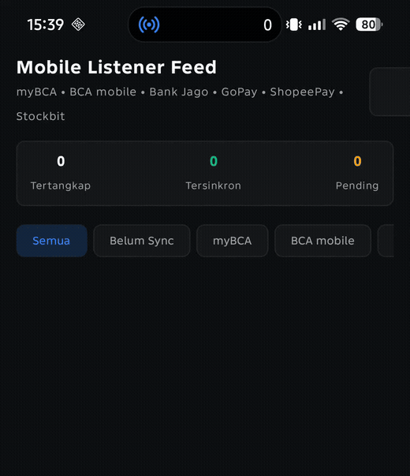
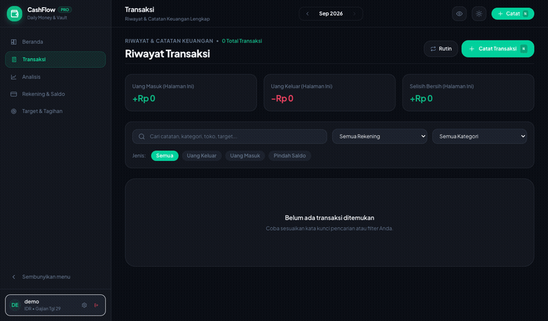

# ⚡️ CashFlow — Frictionless Money Mindfulness & Self-Hosted Vault

> **Stop typing coffee receipts into spreadsheets at 11 PM.**  
> CashFlow is a self-hosted personal finance companion built for daily mindfulness, zero-effort automation, and absolute financial privacy.

---

## 🌟 The Magic Flow: Notification ➔ Instant Parse ➔ Live Ledger

You tap your card or QRIS at lunch. By the time you lock your phone, your net worth, category spending, and daily safe-to-spend allowance are already updated. **Zero manual entry. Zero cloud subscription fees. Zero data tracking.**

<div align="center">

| 📱 **Android Companion Listener**<br>*(On-device push interception & regex parsing)* | 💻 **Self-Hosted Web Ledger**<br>*(Instant zero-effort transaction append & audit log)* |
| :---: | :---: |
|  |  |

*Watch a BCA salary notification arrive on the phone (left) — intercepted, parsed in <300ms, and automatically appended into the self-hosted ledger list (right).*

</div>

---

## 💡 Why CashFlow?

Traditional personal finance apps fail for two big reasons:

1. **Manual Logging Fatigue:** Opening an app, selecting a category, picking a date, typing `Rp 35.000`, and pressing save for every cup of coffee is exhausting. Within two weeks, everyone gives up and falls back into spreadsheet debt.
2. **Privacy Invasive & Subscription Bloat:** Cloud aggregators want your direct banking credentials, sell your spending habits to advertiser networks, and charge $10/month for a glorified pie chart.

**CashFlow takes the hacker-native approach:**
- ⚡️ **Zero-Touch Ingestion:** A lightweight Android listener captures banking push notifications, parses the amount, sender, and category entirely on-device, and posts directly to your private server via secured Bearer API.
- 🎯 **Daily Safe-To-Spend Mindfulness:** No confusing 100-row budget sheets. Just one clear, stress-free number: *"How much is safe to spend today without breaking this month's runway?"*
- 🛡️ **100% Self-Hosted Sovereignty:** Built on FastAPI, PostgreSQL, Next.js, and Redis. All ledger entries, accounts, and financial credentials live exclusively on your own infrastructure.

---

## 🚀 Core Superpowers

### 1. 📱 Zero-Tap Mobile Interception (Android Companion)
Runs silently in the background using native Android `NotificationListenerService`. Battery impact is virtually zero (<0.1% daily).
- **Out-of-the-Box App Intelligence:**
  - **BCA & myBCA:** Inbound transfers, salary deposits, QRIS payments, debit card spending.
  - **Bank Jago:** Single pocket withdrawals, dual-pocket transfers (`Main Pocket ➔ Emergency Fund`), incoming transfers.
  - **GoPay:** QRIS merchant payments, GoPay Tabungan internal movements, bank transfers.
  - **ShopeePay:** Merchant checkouts, peer-to-peer transfers, top-ups.
  - **Stockbit:** Real-time equity trade fills (`Beli 10 lot BBRI match di Rp 3.850`) updating stock units and RDN cash balances automatically!
- **Strict Spam & Promo Rejection:** Marketing blasts, promo push notifications, OTPs, and cashback vouchers are strictly rejected on-device before any network request is made.

### 2. 🎯 Paycheck Cycle & Daily Pulse
- **Payday-Aligned Cycles:** Budgets operate on your real financial cadence (e.g. 25th to 24th), not arbitrary calendar months.
- **Safe-to-Spend Allowance:** Dynamically adjusts your daily allowance based on remaining days and actual burn rate.
- **Kakeibo Financial Allocation:** Visual 50 / 30 / 20 breakdown (Needs, Wants, Savings & Investment) to keep cash flow balanced.

### 3. 🏦 Multi-Vault Liquidity & Asset Portfolio
- **Cash, Banks & E-Wallets:** Real-time balances for physical cash, bank accounts, and digital wallets with 1-tap internal transfers.
- **Investment Portfolio & RDN:** Track stock lots and weighted-average buy price (WAC) with direct source account linking.

### 4. 🤖 Telegram AI Companion with Receipt OCR
- **Natural Language Chat:** Send *"beli makan 50rb pake bca"* or *"transfer 500k dari BCA ke Jago"*. DeepSeek AI parses intent and records the transaction instantly.
- **Receipt Photo Ingestion:** Snap a photo of any receipt in Telegram — the bot extracts line items, tax, total, and timestamp automatically.

### 5. 🎨 Linear-Grade Craft & Density
- High-contrast, dark-first Bauhaus visual language.
- Monospaced tabular digits for currencies, sub-millisecond keyboard shortcuts (`N` for quick entry), and responsive desktop/mobile layouts.

---

## 🛠️ Technical Architecture

```
┌─────────────────────────────────────────────────────────────┐
│                   CashFlow Ecosystem                        │
├─────────────────────────┬───────────────────────────────────┤
│  📱 Mobile Listener     │  🤖 Telegram Bot                  │
│  - Android Native       │  - Python + DeepSeek AI           │
│  - On-Device Regex      │  - Receipt OCR Vision             │
│  - Secured Bearer Post  │  - Natural Language Interface     │
└────────────┬────────────┴─────────────────┬─────────────────┘
             │                              │
             ▼                              ▼
┌─────────────────────────────────────────────────────────────┐
│  ⚡️ FastAPI Backend (:8000)                                 │
│  - Single unified auth (Starlette Sessions + Bearer Tokens) │
│  - High-performance Psycopg3 connection pooling             │
│  - Strict CSRF protection & origin validation               │
└────────────┬──────────────────────────────┬─────────────────┘
             │                              │
             ▼                              ▼
┌───────────────────────────┐  ┌──────────────────────────────┐
│  🐘 PostgreSQL 16         │  │  ⚡️ Redis 7                 │
│  - Core 5-table ledger    │  │  - Ephemeral cache           │
│  - ACID transaction logs  │  │  - Rate limiting & locks     │
└───────────────────────────┘  └──────────────────────────────┘
```

---

## 📦 Quickstart (Docker Compose)

### 1. Clone & Configure

```bash
git clone https://github.com/alfonsusenrico/cash-flow-tracker.git
cd cash-flow-tracker

# Copy environment template
cp .env.example .env

# Generate secure secrets
SESSION_SECRET=$(openssl rand -hex 32)
POSTGRES_PASSWORD=$(openssl rand -base64 32 | tr -dc 'A-Za-z0-9' | head -c 32)
INVITE_CODE=$(openssl rand -base64 24 | tr -dc 'A-Za-z0-9' | head -c 24)

sed -i.bak "s/^SESSION_SECRET=.*/SESSION_SECRET=${SESSION_SECRET}/" .env
sed -i.bak "s/^POSTGRES_PASSWORD=.*/POSTGRES_PASSWORD=${POSTGRES_PASSWORD}/" .env
sed -i.bak "s/^INVITE_CODE=.*/INVITE_CODE=${INVITE_CODE}/" .env
rm -f .env.bak
```

### 2. Run Database Migrations & Start

```bash
# Spin up database and execute migrations
docker compose up -d db
docker compose run --rm migrate

# Start all services
docker compose up -d
```

Open **`http://localhost:8090`** in your browser.

### 3. Register & Initial Setup
1. Click **First time? Register** on the login page.
2. Enter your chosen username, password, and the `INVITE_CODE` from your `.env`.
3. Add your bank accounts or wallets in **Rekening & Saldo**.
4. Generate an API Key under your profile menu for companion app pairing.

---

## 📲 Pairing the Mobile Companion App

1. Build or download the debug APK from `financial-tracker-mobile-listener`:
   ```bash
   cd ../financial-tracker-mobile-listener
   ./gradlew assembleDebug
   adb install -r app/build/outputs/apk/debug/app-debug.apk
   ```
2. Open **Mobile Listener** on your Android device.
3. Open **Pengaturan (Settings)**:
   - **Server URL:** `https://finance.your-domain.com` (or your LAN IP)
   - **API Key:** Paste your user `cfk_...` Bearer token.
4. Grant **Notification Access** when prompted by Android.
5. You're all set! Any notification from BCA, Jago, GoPay, ShopeePay, or Stockbit will sync automatically.

---

## 🔌 API Reference Highlights

Every account can authenticate via Session Cookie (browser) or Bearer Token (mobile companion & automation scripts).

- `POST /api/transactions` — 1-call expense, income, or transfer entry.
  ```json
  {
    "type": "income",
    "amount": 1500000,
    "account_name": "BCA",
    "category_name": "Gaji",
    "notes": "PT TEKNOLOGI KARYA",
    "date": "2026-09-16T15:33:14Z"
  }
  ```
- `GET /api/pulse` — Returns today's spending, remaining daily allowance, and monthly pace.
- `GET /api/dashboard/overview?timeframe=cycle` — Full financial health KPIs, cumulative cashflow, and Kakeibo breakdown.
- `GET /api/accounts` — Balance snapshot across all liquid and investment accounts.

Interactive Swagger API docs are available at **`/api/docs`**.

---

## 💻 Development & Verification Commands

- **Backend Tests:**
  ```bash
  cd backend
  python -m pytest tests/
  ```
- **Frontend Typecheck & Build:**
  ```bash
  cd frontend
  npm run type-check
  npm run build
  ```
- **Mobile Companion Unit Tests:**
  ```bash
  cd ../financial-tracker-mobile-listener
  ./gradlew testDebugUnitTest
  ```
- **Database Backup:**
  ```bash
  docker compose exec db sh -c 'pg_dump -U "$POSTGRES_USER" "$POSTGRES_DB"' > backup.sql
  ```

---

## 📄 License

MIT License. Crafted for personal sovereignty and frictionless money mindfulness.
