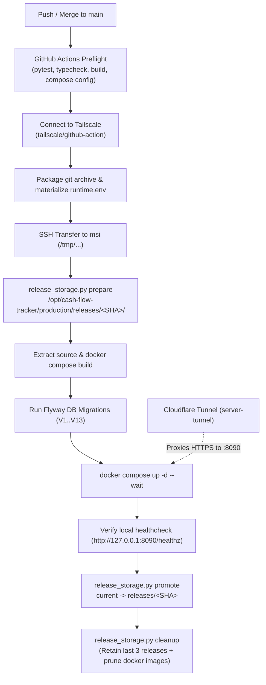

# Cash Flow Tracker — Production Deployment & CI/CD Runbook

This document details the production deployment pipeline, server architecture on `msi` (`msigs63vr`), Cloudflare Tunnel routing, and GitHub Actions CI/CD automation.

---

## 1. Architectural Baseline

Delivery follows the immutable release model established in professional school-agent platforms:



### Core Tenets
1. **Immutable Releases:** No `git pull` on the production server. Code is extracted strictly from pinned Git commit archives into `/opt/cash-flow-tracker/production/releases/<SHA>/`.
2. **Safe Atomic Promotion:** Active production traffic points to `/opt/cash-flow-tracker/production/current`. Symlink promotion occurs **only after** image build, database migration, and container healthchecks succeed. If any step fails, the previous release stays online.
3. **Automated Pruning:** Older releases are cleaned up automatically (retaining active + 3 prior releases), and dangling Docker images are pruned.
4. **Isolated Secrets:** Secrets are materialized directly into `<release_dir>/runtime.env` (`mode 0600`) and never committed into Git.
5. **Automated Ingress Routing:** Cloudflare Tunnel proxies traffic to `127.0.0.1:8090` without exposing ports publicly.

---

## 2. Server Topology (`msi` / `msigs63vr`)

- **OS:** Debian GNU/Linux 6.12 (x86_64)
- **Deployment Root:** `/opt/cash-flow-tracker/production/`
- **Owner / Permissions:** `enr1c0:enr1c0` (mode `0750`)
- **Web Ingress Port:** `127.0.0.1:8090` (reverse-proxied by Cloudflare Tunnel)
- **Tailscale IP:** `100.85.113.31`
- **Public Domain:** `https://finance.alfonsusenrico.com`
- **Telegram Webhook:** `https://telegram-webhook.alfonsusenrico.com/cash-flow-tracker/telegram/webhook`

---

## 3. GitHub Secrets Configuration Checklist

Register these secrets in GitHub under `Settings -> Secrets and variables -> Actions`:

| Secret Name | Description | Example / Note |
|---|---|---|
| `TAILSCALE_AUTHKEY` | Reusable or ephemeral Tailscale auth key | From Tailscale Admin -> Settings -> Keys |
| `DEPLOY_SSH_KEY` | Private SSH key matching `enr1c0@msi` | Matches `~/.ssh/authorized_keys` on `msi` |
| `SESSION_SECRET` | 32-byte random session encryption key | Generated via `openssl rand -hex 32` |
| `POSTGRES_PASSWORD` | Secure PostgreSQL database password | Used by postgres container and backend pool |
| `INVITE_CODE` | Registration invite code | E.g. `CASHFLOWTRACKER` |
| `TELEGRAM_BOT_TOKEN` | *(Optional)* Telegram bot authentication token | From @BotFather |
| `TELEGRAM_WEBHOOK_SECRET` | *(Optional)* Secret header for Telegram webhook | Arbitrary secure string |
| `DEEPSEEK_API_KEY` | *(Optional)* API key for DeepSeek or OpenRouter | For AI receipt / natural language parsing |
| `BOT_SECRET` | *(Optional)* Internal bot authentication secret | Arbitrary secure string |

*(Defaults for `DEPLOY_HOST=100.85.113.31`, `DEPLOY_USER=enr1c0`, `DEPLOY_PORT=22`, and `DEPLOY_ROOT=/opt/cash-flow-tracker` are configured automatically).*

---

## 4. Cloudflare Tunnel Automation Tool (`cf-route`)

A dedicated CLI utility is installed at `/usr/local/bin/cf-route` on `msi`:

```bash
# Route a subdomain to a local port:
cf-route <subdomain> <port>

# Example: Route finance.alfonsusenrico.com to port 8090
cf-route finance 8090
```

The command automatically:
1. Registers Cloudflare DNS via `cloudflared tunnel route dns -f server-tunnel <hostname>`.
2. Updates `/etc/cloudflared/config.yml` before the catch-all `404` rule.
3. Validates ingress syntax.
4. Restarts `cloudflared` systemd service.
5. Verifies public HTTPS reachability and outputs the live URL.

---

## 5. Manual Rollback Procedure

If a deployed release needs to be rolled back to an earlier version:

```bash
# SSH into the server
ssh msi

# Point current release symlink to previous SHA
cd /opt/cash-flow-tracker/production
python3 current/source/scripts/release_storage.py promote \
  --environment-root /opt/cash-flow-tracker/production \
  --release-sha <PREVIOUS_COMMIT_SHA>

# Restart containers with the previous release
cd /opt/cash-flow-tracker/production/current/source
docker compose --project-name cashflow-production --env-file ../runtime.env up -d --no-build
```
