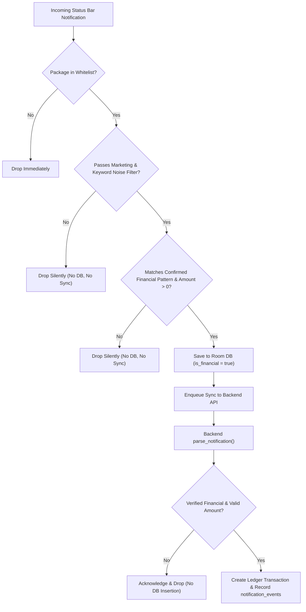

# Design: Strict Financial Notification Filtering

## Architecture Strategy

### 1. Multi-Tier Defense Against Notification Noise
To prevent spamming the user's ledger and mobile feed, filtering occurs in two explicit tiers:



### 2. Mobile Listener Implementation Details (`financial-tracker-mobile-listener`)
- **`FinancialNotificationListenerService.kt`**:
  - Add comprehensive blocklist for common promo keywords across Indonesian superapps:
    - `"goride"`, `"gofood"`, `"gosend"`, `"gomart"`, `"harga pelajar"`, `"promo"`, `"diskon"`, `"voucher"`, `"cashback yuk"`, `"special cashback"`, `"pinjaman"`, `"proteksi"`, `"paket gojek"`, `"kabar baik"`, `"semangat terus"`, `"siap-siap dapet"`, `"net sell"`, `"net buy"`, `"ihsg"`, `"yield"`, `"saham pilihan"`.
  - For Gojek / ShopeePay / Stockbit / Banks, check whether the notification has action words indicating settlement:
    - Transfers: `"berhasil transfer"`, `"udah dikirim"`, `"menerima"`, `"telah menerima"`, `"mengirimkan dana"`, `"has sent"`, `"has been moved"`.
    - Payments / Expenses: `"kamu bayar"`, `"pembayaran berhasil"`, `"pengeluaran sebesar"`, `"you spent"`, `"debet"`, `"terdebit"`.
    - Income: `"pemasukan sebesar"`, `"you received"`, `"top up berhasil"`, `"saldo ditambahkan"`.
    - Investment: `"match di harga"`, `"order match"`.
- **`NotificationProcessor.kt`**:
  - `extractDetectionSummary` will default to `DetectionSummary(isFinancial = false)` when no transaction pattern matches.
  - In `processNotification`:
    ```kotlin
    if (!summary.isFinancial || summary.expectedAmount == null || summary.expectedAmount <= 0.0) {
        Log.d(TAG, "Discarded non-financial notification: '$title' - '$bodyText'")
        return
    }
    ```
- **Cleanup of Existing Local Records**:
  - In `NotificationDao.kt`:
    ```kotlin
    @Query("DELETE FROM raw_notifications WHERE is_financial = 0 OR expected_amount IS NULL OR expected_amount <= 0 OR event_class = 'unknown'")
    suspend fun deleteNonFinancialNoise(): Int
    ```
  - Trigger this cleanup automatically on startup in `FinancialTrackerApp.kt` or `MainActivity.kt`.

### 3. Backend Implementation Details (`cash-flow-tracker`)
- **`services/notification_parser.py`**:
  - Change generic fallback from `is_financial=True, event_class="unknown"` to:
    ```python
    return ParsedNotification(
        is_financial=False,
        event_class="noise",
        amount=None,
        currency="IDR",
        ...
    )
    ```
- **`routers/ingest.py`**:
  - In `ingest_notifications`:
    - Check `if not parsed.is_financial or parsed.event_class == "noise" or not final_amount or final_amount <= 0: continue`
    - Do not insert noise items into `notification_events`.
- **Server DB Cleanup**:
  - Execute a query on `ledger_db` to remove historical noise:
    ```sql
    DELETE FROM notification_events 
    WHERE transaction_id IS NULL 
      AND (event_class = 'unknown' OR is_financial = FALSE OR expected_amount IS NULL OR expected_amount <= 0);
    ```

### 4. Trade-offs & Guardrails
- **Guardrail:** Never drop notifications that contain actual money movement confirmations. Any new transaction format from myBCA, BCA Mobile, Jago, GoPay, ShopeePay, or Stockbit will be explicitly matched with regex.
- **Safety:** Deleting noise only affects records where `transaction_id IS NULL`, ensuring no legitimate financial transaction history is touched.
